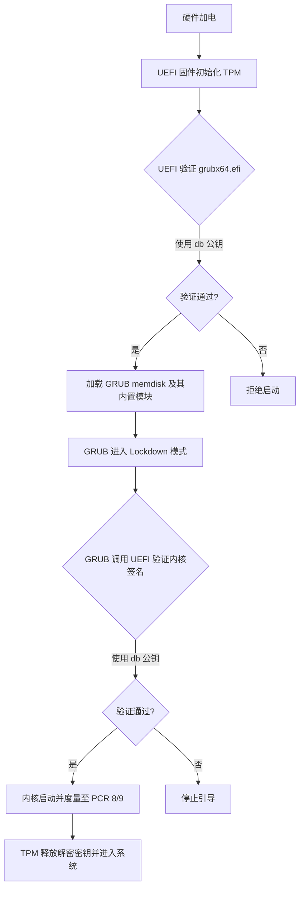
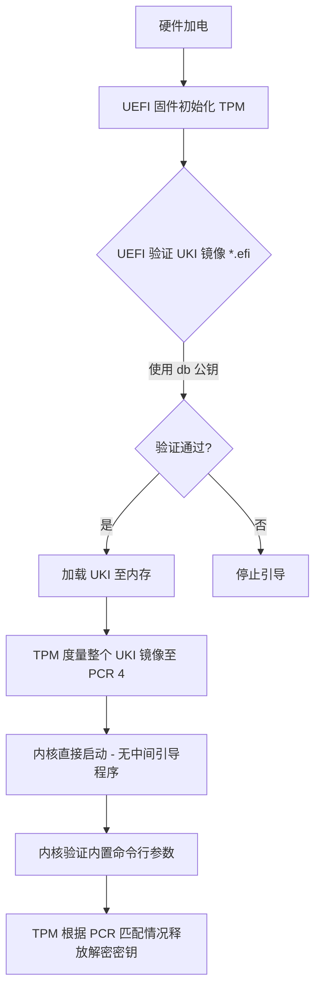
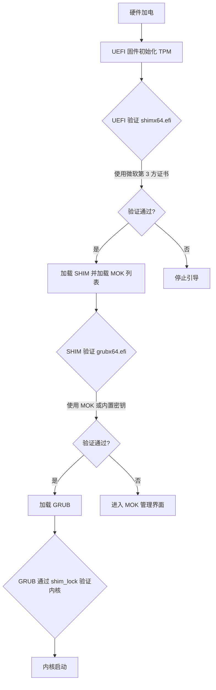
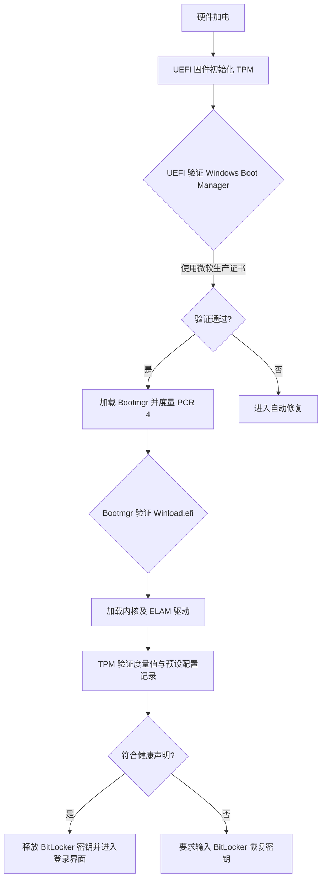

## 安全启动简介

安全启动 (Secure Boot) 是一项现代电脑固件 (UEFI/BIOS) 的安全功能，用于阻止未授权的恶意软件在电脑启动过程中加载，确保系统只加载经过数字签名、来自可信来源的引导程序和驱动程序，从而提高系统安全性和稳定性，抵御病毒和 Rootkit。它通常在 Windows 10/11 系统中默认开启，与 UEFI 模式配合使用。 

### 安全启动核心作用

- **防范恶意软件**: 验证启动组件的数字签名，防止勒索软件、Rootkit 等在启动早期就感染系统。
- **支持反作弊软件**: 许多游戏（例如《堡垒之夜》、《战地6》、《Valorant》）需要安全启动来检测和阻止作弊工具。
- **提升系统完整性**: 确保只有经过签名的安全代码运行，维护操作系统的完整性。 

### 检查安全启动是否启用

- 在 Windows 中按 `Win + R`，输入 `msinfo32`，在“`系统摘要`”中查看“`安全启动状态`”是否为“`开启`”。
- 在 Linux 系统中, 可以使用`mokutil --sb-state`, `bootctl status`, `dmesg | grep -i "secure boot"` 等方法查询安全模式是否启用

>  “安全启动”不同于系统的“安全模式（Safe Mode）”。安全启动是硬件级的验证过程，而安全模式是 Windows 的一种低负载故障排除运行状态。 
{: .prompt-tip }

### 安全启动原理

安全启动（Secure Boot）保证系统不被篡改的核心在于构建了一条硬件级的“信任链” (Chain of Trust)。

- 安全启动通过“逐级验证”来确保系统文件（如引导加载程序、内核、驱动）的完整性：
- 信任根 (Root of Trust)： 固化在主板硬件（如烧录在芯片中的公钥或哈希值）中的最底端信任点。
- 数字签名验证： 每个启动阶段的代码在运行前，都必须由前一个已信任的阶段进行验证。
  - 第一步： `固件（UEFI BIOS）`启动，根据内置的`公钥数据库（db）`检查引导加载程序（如 `Windows Boot Manager` 或 `GRUB`）的数字签名。
  - 第二步： 被信任的引导加载程序再验证操作`系统内核（Kernel）`的签名。
  - 第三步： 内核进一步验证关键驱动程序和启动文件的签名。
- 拒绝加载： 如果任何环节的文件被篡改（哈希值不匹配）或未经过信任机构签名，签名验证就会失败，系统将强制停止启动，从而防止 Rootkit 等恶意软件运行。 

> 安全启动与 TLS（传输层安全性协议，如 HTTPS）在底层数学原理上是高度相似的，安全启动可以看作是“发生在计算机内部的 TLS 握手”，它不是在验证你要访问的网站是否安全，而是在每一步启动时验证即将运行的代码是否真的是由受信任的厂商发布的，且未被改动过。 
{: .prompt-info }

## Linux的安全启动方案

### 直接签名使用BIOS验证
- **工作原理**： 直接进入 BIOS ，清除出厂自带的微软证书，并上传自己的 `PK (Platform Key)` , `KEY(Key Exchange Key)`和 `db (Signature Database)` 证书。(部分主板也允许直接增加新的db公钥)
- **验证机制**： 硬件固件直接根据私钥验证内核，不再信任任何第三方（包括微软）。
- **优点**： 实现了完全的硬件掌控权。
- **缺点**： 操作复杂且具有排他性，如果未正确导入微软证书，Windows 将无法启动（除非已安装的所有系统均使用自己的密钥重签）。

针对使用自己的密钥对签名系统针对Linux的启动流程又分为以下两种方案: 

- 为GRUB的EFI签名, 并继续使用GRUB引导启动Linux内核
- 或者直接将Linux内核打包为EFI镜像并签名直接启动

#### GRUB-Standalone
`grub-mkstandalone` 是 GRUB 引导器提供的一个高级辅助工具，专门用于生成一个**自包含的、独立的 EFI 引导镜像文件**。 它是构建高安全性 Linux 系统的核心工具，其本质是将 GRUB 的所有组件“打包”成一个整体。

在 Linux 下使用安全启动时，使用 `grub-mkstandalone`，主要出于以下核心原因：

1. 解决模块签名难题

    在标准的 GRUB 安装中，核心程序（`core.img`）非常小，它会在启动时从磁盘（通常是 `/boot/grub/x86_64-efi/`）动态加载各种功能模块（`.mod` 文件），如文件系统驱动、加密支持等。 

    - **安全冲突**： 一旦开启安全启动，固件要求每一个被加载的执行文件都必须有数字签名。
    - **打包优势**： `grub-mkstandalone` 会将所有必要的模块直接“内置”到生成的 `.efi` 二进制文件中。这样你只需要对这一个生成的 `EFI 文件`进行签名，就能绕过“需要为数百个小模块分别签名”的繁琐过程。 

2. 强制开启GRUB的签名验证

    普通的 `grub-install` 往往无法在启动的最早期强制开启验证模式。

    - **预载验证**： 使用 `grub-mkstandalone` 时，你可以通过 `--modules` 参数预载 `verify` 模块，并嵌入一个初始配置文件（通常包含 `set check_signatures=enforce`）。
    - **不可篡改**： 由于这个初始配置被打包在已签名的二进制文件内部，黑客无法通过修改外部磁盘上的 `grub.cfg` 来关闭验证功能。 

3. 构建完整的信任链

    当导入自己的 BIOS 密钥后，这个密钥成为了系统的唯一最高信任源。

    - **独立性**： `grub-mkstandalone` 生成的镜像不依赖磁盘上现有的 GRUB 结构。
    - **分段保护**： 它通常配合 `GPG 密钥`使用。该单体镜像被 BIOS 验证后，会利用其内部嵌入的 `GPG 公钥`去验证磁盘上的`内核`、`Initrd` 以及后续的配置文件。这种方案确保了从固件到内核的每一字节都被核实。 

**GRUB Standalone镜像启动验证流程如下**:



#### UKI 方案
这是目前 Arch Linux 玩家或对安全性有极高要求的用户首选的方案。 

- **工作原理**： 将`内核`、`initrd` 和`内核启动参数`直接打包成一个单一的 `.efi 文件`（即 Unified Kernel Image）。
- **验证机制**：
    1. **配合 MOK**：直接对该 `UKI` 文件签名，由 `Shim` 验证。
    2. **配合 TPM**：利用 `TPM 测量（Measurement）`功能，确保 `UKI` 未被改动，且启动参数被锁定。
- **优点**： 极大地缩小了攻击面，防止通过`篡改启动参数`或 `initrd` 来绕过安全检查。

**UKI启动验证流程如下**:




### 使用Shim验证
这是 Ubuntu、Fedora、RHEL 等主流发行版默认采用的方案，最适合普通用户。 

- **工作原理**：
    1. **Shim（垫片）**： 一个由微软签名的微型引导程序。由于几乎所有 PC 固件都预装了微软证书，`Shim` 可以直接启动。
    2. **MOK (Machine Owner Key)**： `Shim` 启动后，会维护一个用户自有的密钥库。你可以将自己的公钥导入 `MOK` 列表。
    3. **二次验证**： `Shim` 使用 `MOK` 或发行版内置证书来验证后续的 `GRUB 引导程序`及 `Linux 内核`。

- **优点**： 兼容性最好，安装即用，无需修改 BIOS/UEFI 硬件密钥。
- **缺点**： 启动链路较长，且 `initrd`（初始内存盘）在旧版本实现中通常不被验证，存在安全盲区。
- **Sbat机制**: SBAT (Secure Boot Advanced Targeting) 是一种用于增强 UEFI 安全启动撤销机制的技术，由 Linux 社区与微软合作开发。 它旨在解决传统“黑名单(DBX数据库)”机制在面对大规模版本漏洞时容量有线的局限性
    1. 它在 EFI 二进制文件中嵌入一段简单的元数据（通常是 CSV 格式），包含`组件名称`和`版本号（代际数）`。
    2. 系统固件中存储一个“`允许的最小代际数`”。
    3. 启动时，系统只需对比版本号。如果文件的代际数低于要求，即使签名有效，也会被拒绝启动

    > SBAT 并不是由 UEFI 硬件标准强制执行的底层逻辑，而是由 Shim 维护的一套验证规范, 在使用Shim的时候可能需要为EFI镜像文件手动加入Sbat数据段
    {: .prompt-tip }

**Shim启动验证流程如下**:



### 参考: Windows的安全启动流程 

Windows 和 Linux 虽然都运行在相同的 UEFI 安全启动（Secure Boot）框架下，但在信任链深度、内核加载机制以及 TPM 联动方式上存在区别。

- **信任根的来源**: Windows信任根高度统一。它完全依赖微软生产证书, 硬件厂商在出厂时会将该证书内置在 BIOS 的 `db` 库中，实现开箱即用的闭环信任。
- **引导过程的连续性**: Windows 的引导链是高度集成的。`BootManager` -> `Winload.efi` -> `Kernel` -> `ELAM` (提前启动反恶意软件驱动), 每一层都深度检查下一层的哈希，并且 ELAM 允许 Windows 在加载第三方驱动前先加载安全驱动，确保杀毒软件比病毒更早运行
- **TPM 与数据保护的联动**: Windows 会将哈希值存储在特定的 `PCR` 寄存器（如 `PCR 7`）。只要固件或安全启动设置发生微小变化，`PCR 7` 就会改变，`TPM` 立即锁定 `BitLocker` 密钥, Linux 可以由用户决定哪些 `PCR`值参与解密
- **远程证明**: 拥有成熟的 Windows 健康证明服务 (DHA)。在企业环境中，如果 TPM 记录的启动流程不符合预设模板，服务器可以直接拒绝该设备接入企业内网

以下是 Windows 与 Linux 安全启动流程的核心差异对比：

**Windows启动验证流程如下**:



---

## 操作流程
以下操作流程使用`Sbctl`对`EFI镜像`文件签名, 通过`Grub-Standalone`打包`EFI镜像`并使用`BIOS`验证签名, 最终引导启动`Manjaro Linux`
    
### 安装签名工具并生成密钥对
对于生成签名并对系统镜像签名我们可以使用`sbctl`工具完成

> `sbctl` 是一款专为 Linux 设计的用户友好型安全启动（Secure Boot）密钥管理器
>
> - **自动化签名**: `sbctl` 提供软件包管理器钩子（如 Arch 的 `pacman hook`），在系统内核更新时，它会自动在后台完成签名
> - **密钥生命周期管理**： 自动化生成、导入和导出安全启动密钥（包括 PK、KEK、db）
> - **一键注册**: 可以直接将生成的密钥写入主板固件（EFI 变量），支持将微软证书一并导入以维持双系统兼容
> - **EFI 捆绑支持**: 支持生成“统一内核镜像 (UKI)”，将内核、initramfs 和启动参数打包并签名
{: .prompt-info }

**安装 sbctl**  

`sbctl` 已经包含在 Manjaro 的官方仓库中，可以直接使用 `pacman` 安装：

```bash
sudo pacman -S sbctl
```

**确认系统状态**  

在进行任何操作签名前，先确认系统当前的 EFI 变量和安全启动状态：

```bash
sbctl status
```

- **Setup Mode**: 如果显示 `Enabled`，说明你可以直接通过软件写入密钥（通常需要先在 BIOS 中选择 "`Reset to Setup Mode`" 或 "`Restore Factory Keys`" 之前的清空操作）。
- **Secure Boot**: 显示当前是否已开启安全校验。

**生成密钥**

生成一套全新的私有密钥, 包括（PK, KEK, db）:

```bash
sudo sbctl create-keys
```

这些密钥默认存储在 `/var/lib/sbctl/keys/` 或者 `/usr/share/secureboot/keys`(老版本`sbctl`) 目录下。

### 公钥填充SKID
在 UEFI 安全启动中，`SKID (Subject Key Identifier)` 是证书中用于标识公钥的扩展字段。某些严苛的固件（BIOS）如果检测到证书缺少 `SKID`，可能会拒绝导入密钥或在签名验证时报错。

如果证书公钥缺少该字段，可以通过以下步骤修改配置并重新生成。

`sbctl` 在生成密钥时会调用系统的 `OpenSSL` 配置。你需要创建一个自定义配置文件（例如 ext.cnf），强制加入 `subjectKeyIdentifier`。

```
basicConstraints = CA:FALSE
keyUsage = digitalSignature
subjectKeyIdentifier = hash
authorityKeyIdentifier = keyid,issuer
```
{: file='ext.cnf'}

签名我们已经生产了密钥对在`/var/lib/sbctl/keys/db/`目录下的 `db.key` 和 `db.pem`, 这里不需要更换私钥，只需用私钥重新生成带 SKID 的证书（`.crt`）。

```bash
sudo openssl x509 -in db.pem -out new-db.pem -signkey db.key -days 3650 -extfile ext.cnf
```

UEFI 固件（BIOS）在手动导入证书时，通常只识别二进制格式的 `.cer` 或 `.der` 文件, 而`.pem` 通常是文本格式（Base64 编码）, 这里我们还需要执行以下转换

```bash
# 转化为 cer
openssl x509 -in db.pem -outform DER -out new-db.cer

# 或者转化为 der
openssl x509 -in db.pem -outform DER -out new-db.der
```

> 在 OpenSSL 中，-outform DER 生成的文件通常命名为 .cer 或 .der，两者内容一致。
{: .prompt-tip } 

验证 `SKID` 是否填充成功:

```bash
# 检验pem格式
openssl x509 -in  new-db.pem -text -noout | grep -A 1 "Subject Key Identifier"

# 检验der格式
openssl x509 -in new-db.crt -inform DER -text -noout | grep -A 1 "Subject Key Identifier"
```

- **如果已填充**： 你会看到类似 Subject Key Identifier: 及其下方跟着的一串 十六进制哈希值（如 A1:B2:C3...）。
- **如果未填充**： 该命令将没有任何输出，或者在完整文本中找不到该字段。

### 使用 GRUB Standalone 生成EFI镜像

这里我们使用 `grub-mkstandalone` 生成一个不依赖外部文件、自包含驱动的 EFI 启动镜像

> 为什么在安全启动下使用 `grub-mkstandalone` 而不是 `grub-install`
>
>  `grub-mkstandalone` 与 `grub-install` 的深度对比
> 
> | 特性     | `grub-install` (标准安装)                                  | `grub-mkstandalone` (单一镜像)                        |
> | :------- | :--------------------------------------------------------- | :---------------------------------------------------- |
> | 文件分布 | 仅 EFI 文件在分区，驱动 (`.mod`) 在 `/boot/grub`。         | **所有驱动模块和初始脚本全部封装在 EFI 文件内**。     |
> | 签名难度 | **极高**。需要为 EFI 和数百个 `.mod` 文件分别签名。        | **极低**。只需要对生成的这一个 EFI 文件签名。         |
> | 防篡改能 | **弱**。攻击者可以轻易替换磁盘上的 `.mod` 驱动或修改配置。 | **强**。核心驱动和找盘逻辑被锁定在已签名的二进制内。  |
> | 启动可靠 | 依赖磁盘文件。如果文件系统损坏，直接进入 `grub rescue`。   | 即使磁盘损坏，镜像也能启动并运行基本的 `GRUB shell`。 |
>
> 在开启安全启动时，UEFI 固件会验证它加载的每一个 `.efi` 文件。如果使用 `grub-install`：
> 
> - GRUB 核心启动后，会去读取 `/boot/grub/*.mod`。
> - 安全冲突：由于这些 `.mod` 文件通常没被签名，GRUB 会拒绝加载它们，导致系统无法引导。
> - `grub-mkstandalone` 把驱动直接打包进已签名的 EFI 内部，固件只验证一次 EFI 文件，内部的驱动随之获得信任。
{: .prompt-tip }        

**准备嵌入式配置文件 (`early-grub.cfg`)**

这个文件将被打包进镜像内部。它的作用是在无法读取外部硬盘时，先通过内置驱动找到真正的系统分区。

```
set prefix=(memdisk)/boot/grub

insmod btrfs
insmod search_fs_uuid
insmod configfile
insmod all_video

search --no-floppy --fs-uuid --set=root [替换为实际Manjaro安装根分区的UUID]

if [ -f /@/boot/grub/grub.cfg ]; then
    configfile /@/boot/grub/grub.cfg
else
    echo "Error: Cannot find /@/boot/grub/grub.cfg on this partition"
fi
```
{: file='early-grub.cfg'}

> 如果没有根分区的UUID, 可通过以下方式查询
>
> `lsblk -dno UUID /` 或者 `findmnt -n -o UUID /`
>
> 解释：`-d` 仅显示设备，`-n` 不显示表头，`o UUID` 只输出 UUID，`/` 指定查询挂载点为根目录。
>
> 对于像 Manjaro 这样默认使用 `Btrfs` 的系统，UUID 是针对整个物理分区的，而不是针对子卷的。
> 
> - 无论你挂载的是 `/@` 还是 `/@home`，它们的 UUID 都是一样的。
> - 在 `early-grub.cfg` 中，你需要的是物理分区的 UUID。
> - 确认 UUID 后，在 `grub.cfg` 中通过路径 `/@/boot/...` 来区分不同的子卷。
{: .prompt-info }

- **`set prefix=(memdisk)/boot/grub`**: 强制 GRUB 从内存盘（即 EFI 镜像内部）加载模块。这避免了因为无法识别物理硬盘而导致的 `grub rescue` 模式。
- **核心驱动加载**: 手动加载了 `btrfs`（文件系统）、`search_fs_uuid`（定位分区）和 `all_video`（显示图形界面）。
- **精准定位**: 使用 `UUID` 寻找 `Manjaro` 根分区。即使你插了 U 盘或更换了硬盘插槽，UUID 依然能保证找对地方。
- **配置文件重定向**: 找到分区后，它会加载硬盘上的主配置文件 `/boot/grub/grub.cfg`。

**运行打包生产EFI镜像**

```bash
sudo grub-mkstandalone \
 -O x86_64-efi \
 -o /boot/efi/EFI/Manjaro/grubx64_standalone.efi \
 --disable-shim-lock \
 --modules="part_gpt btrfs search_fs_uuid echo configfile normal tpm" \
 "boot/grub/grub.cfg=./early-grub.cfg"
```

- **`-o .../grubx64_standalone.efi`**: 生成一个独立的 EFI 二进制文件。
- **`--disable-shim-lock`**: 关键选项。这表示不打算使用 `Shim`，而是准备直接用 `sbctl` 对该文件签名并由 `BIOS` 直接引导。它禁用了 `GRUB` 对 `Shim` 接口的调用，避免了在没有 `Shim` 环境下运行时报错。
- **`--modules="..."`**: 把最基础的驱动（`GPT 分区表`、`Btrfs`、`TPM` 等）直接塞进镜像。
- **`"boot/grub/grub.cfg=./early-grub.cfg"`**: 核心动作。它把磁盘上的 `early-grub.cfg` 映射为镜像内内存盘的配置文件。

> 这里的生产配置输出的EFI是`grubx64_standalone.efi`, 此时`/boot/efi/EFI/Manjaro/`目录下包含新生成的`grubx64_standalone.efi` 和系统安装生成的`   `, 这是可同时通过两个EFI镜像启动Manjaro, 如果`grubx64_standalone.efi`配置测试通过后可直接输出为`grubx64.efi`, 覆盖系统默认配置
{: .prompt-tip }

### 对需要的文件签名
在完成新的GRUB镜像生成后, 就可以执行对系统组件的签名

需要签名的文件分为以下两类:
- 系统内核文件
- 启动引导的EFI镜像文件
- 第三方驱动

**为内核文件签名:** 

```bash
sudo sbctl sign -s /boot/vmlinuz-*-x86_64
```

`vmlinuz-*-x86_64` 内核文件名替换为实际使用的内核版本号, 例如`vmlinuz-6.12-x86_64`

**为启动引导的EFI镜像文件签名:**

```bash
# 测试生成的独立 GRUB 镜像
sudo sbctl sign /boot/efi/EFI/Manjaro/grubx64_standalone.efi

# Manjaro 默认的引导文件
sudo sbctl sign -s /boot/efi/EFI/Manjaro/grubx64.efi

# Manjaro 默认的引导文件备份
sudo sbctl sign -s /boot/efi/EFI/boot/bootx64.efi
```

带 `-s` 参数签名会自动加入列表, 后续文件更新时, `sbctl`会自动签名

> 在 Manjaro 的 EFI 分区中, 存在 `/boot/efi/EFI/Manjaro/grubx64.efi` 和 `/boot/efi/EFI/boot/bootx64.efi` 两个引导文件
>
> - `/boot/efi/EFI/Manjaro/grubx64.efi`: 这是发行版特定的引导程序,它的唯一任务是启动 GRUB 菜单。它会读取 `/boot/grub/grub.cfg` 并加载内核。
> - `/boot/efi/EFI/boot/bootx64.efi`: 根据 UEFI 标准，如果 BIOS 在 NVRAM 中找不到任何启动项（比如重置了 BIOS，或者换了块硬盘），它会强制去寻找 `/EFI/boot/bootx64.efi`, 在 Manjaro 中，这个文件通常是 `grubx64.efi` 的一个副本, 两者内容一致。如果正常的 `"manjaro" 启动项`损坏，BIOS 会尝试运行这个文件来引导系统
>
> 为什么会有两个引导文件？
> - **NVRAM 依赖**： `Manjaro/grubx64.efi` 依赖于主板芯片（NVRAM）里的记录。
> - **可移植性**： `boot/bootx64.efi` 不依赖任何记录。如果你把这块硬盘拆下来插到另一台电脑上，另一台电脑只能识别并运行 `boot/bootx64.efi`。
{: .prompt-tip }

**第三方驱动签名:**

在安全启动（Secure Boot）开启的状态下，Linux 内核会要求所有加载的模块（驱动）必须经过受信任密钥的签名。对于 NVIDIA 闭源驱动或通过 DKMS 安装的第三方驱动（如特定 Wi-Fi 驱动），你需要手动或自动对 `.ko`（Kernel Object）文件进行签名

流程和上述使用`sbctl`签名的流程一致

**签名完成后验证:**

检查 `sbctl` 数据库中登记的所有文件（包括内核、GRUB、EFI 镜像等）是否依然保持签名状态

```bash
sudo sbctl verify
```

- ✔ (绿色勾选)：表示文件签名完整且有效。
- ✘ (红色叉号)：表示文件未签名或签名已损坏/被覆盖（例如内核更新后未触发自动签名）。

>  Manjaro 在更新内核（如通过 `pacman -Syu`）后，新的内核文件会覆盖旧的已签名文件。虽然有 `Pacman Hook`，但如果 `Hook` 运行失败，你需要手动运行 `sudo sbctl sign-all`。
{: .prompt-tip }

### 在BIOS中导入公钥并启用安全启动
注册公钥到BIOS可以选择直接使用`sbctl`提供的功能

```bash
sudo sbctl enroll-keys -m
```

使用 `-m` 参数，它会在写入你自有的密钥时，同时保留微软的证书（Microsoft 2023 证书），以确保 Windows 双系统能正常启动, 如果你不需要 Windows，可以去掉 `-m`。

`sbctl enroll-keys` 会替换掉BIOS中 全部的 `PK`, `KEK`, `DB` 

---

如果想保留默认的密钥或者BIOS中提供了附加`DB Key`的功能, 可以在BIOS中直接添加, 就像这下面的流程:

> 这里的配置流程使用 MSI Z790 Carbon 主板的 BIOS 演示, 不同厂商的 BIOS 菜单位置可能不同

进入 BIOS 后，点击左上角的 `S 按钮`切换到 高级模式 (Advanced Mode)，或直接按 `F7` 键。

然后导航到如图所示的安全启动设置页面


然后根据上图配置相关选型以启用安全启动

接下来进入图中的`金钥管理`来导入签名的公钥 `new-db.der`


> 如果还没有设置过公钥, 所有的 Key 的 `Key Source `都应该显示为 `Factory`
{: .prompt-info }

这里我们选择 `Authorization Key (db)`, 然后应该会出现以下弹窗


这里我们选择 `附加金钥`, 把我们的 `new-db.der` 公钥导入 BIOS 的 `DB Key` 数据库而不删除自带的Windows公钥


选择 `附加金钥` 后会出现这个弹窗询问是否需要重置 `DB Key` 数据库, 这里我们仅需要添加, 选择`否`


对应微星的BIOS, 这里会有一个奇怪的情况, 这里对话框会消失, 但是背景画面变暗不会恢复, 而不是正确出现目录游览框, 这里需要再按一下`回车Enter`才能正确显示存储器目录

> 这里只会显示一个储存设备的目录, 如果有多块硬盘, 建议把需要密钥和EFI文件复制到U盘中注册
{: .prompt-tip }


然后选中我们前面准备好的 `new-db.der` 公钥


下面我们需要选择公钥类型, 这里选择 `Public Key Certificate`


接下来会出现密钥的确认, 显示公钥UUID, 没有问题按下 `回车Enter` 确认


最后会有一个最终的弹窗确认是否添加公钥到 `DB Key` 数据库, 选择`是`即可, 然后应该会有一个 `Success` 的弹窗


最终完成添加的页面如上图所示, `DB Key` 的 `Key Resource` 为 `Mix`, 其余`载入初始金钥`设置为`禁用`即可

安装完成密钥后并启用安全启动后, 就可以保存BIOS配置重启进入系统, 这是系统已经进入了安全启动模式, 再次运行状态检查:

```bash
sbctl status
```

此时 `Setup Mode` 应该变为 `Disabled`，而 `Installed` 应该显示为 `Yes`（表示密钥已入库）。`Security Boot` 应该显示为 `Enable`, 此时安全启动的配置流程全部完成

## 多系统场景的额外处理
如果设备中安装有启动操作系统或者启动引导器, 配置流程也是类似的

- 对EFI镜像文件和系统内核签名, 使用和GRUB一样的验证流程
- 如果有不能签名的EFI(例如OpenCore), 可以选择在BIOS中注册EFI的HASH值(部分主板支持)

> TL;DR: 为ESP分区内的所有EFI文件签名, 或者将其注册Hash到主板BIOS的安全启动信任列表
{: .prompt-tip }

### Refind配置
使用 rEFInd 代替 GRUB 作为引导管理器，核心逻辑依然是建立“信任链”。由于 rEFInd 作为一个图形化管理器，它不仅需要自身被信任，还需要它加载的驱动和内核也被信任。

首先，需要对安装的 rEFInd 主程序进行签名:

```bash
sudo sbctl sign -s /boot/efi/EFI/refind/refind_x64.efi
```

处理 rEFInd 的文件系统驱动: 

rEFInd 默认使用自己的驱动（如 `btrfs_x64.efi`）来访问 Linux 分区。在安全启动下，这些驱动也必须签名, 路径通常在 `/boot/efi/EFI/refind/drivers_x86_64/`

```bash
sudo sbctl sign -s /boot/efi/EFI/refind/drivers_x86_64/btrfs_x86_64.efi
# 如果有其他驱动如 ext4, 也请一并签名
```

### OpenCore配置       

在 OpenCore（通常用于黑苹果或高级多系统引导）环境下，如果你选择不使用 `sbctl` 等证书签名方案，而是通过主板 BIOS 的 “根据哈希注册（Enroll Hash）” 功能来实现安全启动，需要针对引导链条中的每一个环节进行注册

- 引导器核心文件
  - `/EFI/BOOT/BOOTX64.EFI`: 在 OpenCore 环境下，这个文件通常是 `OpenCore.efi` 的副本。如果你的 BIOS 启动项直接指向 `OC/OpenCore.efi`，则注册该文件
- 所有的驱动程序 (`/EFI/OC/Drivers/`)    
  - `OpenRuntime.efi` (核心驱动，必须注册)
  - `OpenCanopy.efi` (图形界面驱动)
  - `ResetNvramEntry.efi` (NVRAM 管理)
  - `CrScreenshotDxe.efi` (截图驱动)
  - 文件系统驱动 (如 `OpenLinuxBoot.efi` 或 `Ext4Dxe.efi`)  
- 系统检测与工具(`/EFI/OC/Tools/`)
  - `OpenShell.efi` (UEFI Shell)

# 参考

- [grub-mkstandalone — Arch manual pages](https://man.archlinux.org/man/grub-mkstandalone.1.en)
- [GRUB - ArchWiki](https://wiki.archlinux.org/title/GRUB)